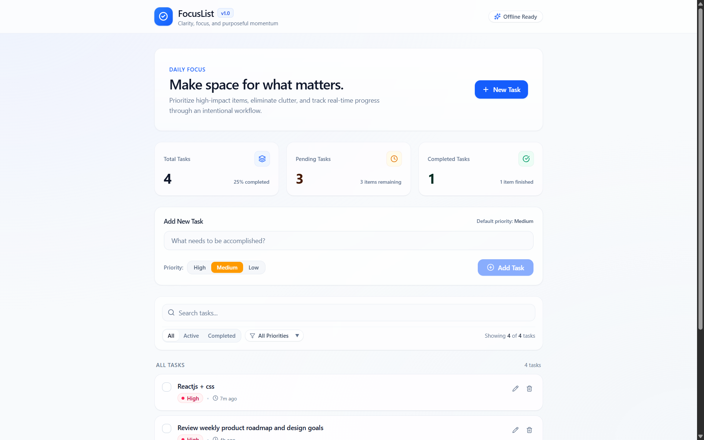

# FocusList

> **Make space for what matters.**  
> A clean, responsive, Apple-inspired task management application built with React 19, TypeScript, Vite, and Tailwind CSS v4.

---

## Overview

**FocusList** is an intentional, distraction-free productivity web application designed around Apple's clean aesthetic. It provides a focused environment for capturing, organizing, and tracking tasks with real-time statistics, multi-criteria filtering, and resilient client-side persistence using browser Local Storage.

The application is frontend-only, requires no external databases or backend services, and is ready for static deployment on Vercel.

---

## Features

### Task Management (CRUD)
- **Create**: Add tasks with title validation (rejects empty or whitespace-only inputs), a 250-character limit, priority selection, and automatic trimming.
- **Toggle**: Mark tasks as completed or reactivate them with an accessible custom checkbox.
- **Edit**: Inline editing for task titles and priority levels with full keyboard support (`Enter` to save, `Escape` to cancel).
- **Delete**: Two-step safe deletion confirmation preventing accidental data loss.

### Priority System
Each task belongs to one of three distinct priority tiers:

| Priority | Accent Color | Intended Usage |
| :--- | :--- | :--- |
| **High** | Rose | Urgent, time-sensitive, or high-impact deliverables |
| **Medium** | Amber | Core daily activities (default selection) |
| **Low** | Emerald | Secondary tasks, backlog items, or administrative chores |

### Real-Time Invariant Statistics
Three live counter cards track task progress:
- **Total Tasks**: Complete count of all stored tasks.
- **Pending Tasks**: Active tasks awaiting completion.
- **Completed Tasks**: Tasks marked as finished.

> **Mathematical Invariant:** `Total Tasks = Pending Tasks + Completed Tasks`  
> Statistics are always computed from the primary task dataset and are never skewed by search or filter states.

### Search & Combined Filters
- **Live Search**: Instant, case-insensitive task filtering by title as you type.
- **Status Filter**: View **All**, **Active**, or **Completed** tasks.
- **Priority Filter**: Filter by **All Priorities**, **High**, **Medium**, or **Low**.
- **Combined Logic**: Search query, status filter, and priority filter combine via logical `AND`.
- **Reset Controls**: One-click **Reset filters** button appears whenever filtering criteria are active.

### Context-Aware Empty States
Informative empty states with contextual actions for 5 specific scenarios:
1. **No Tasks Created**: Welcoming prompt with a button to create the first task.
2. **Search Not Found**: Displays the search query with a button to clear the search term.
3. **No Active Tasks**: Celebratory "All caught up!" state with option to view completed tasks.
4. **No Completed Tasks**: Encouraging message to finish items.
5. **No Priority Matches**: Clear feedback indicating no tasks match the selected priority filter.

---

## Technology Stack

| Category | Package / Tool | Version | Purpose |
| :--- | :--- | :--- | :--- |
| **Framework** | [React](https://react.dev/) | `^19.2.8` | Component architecture & state management |
| **Language** | [TypeScript](https://www.typescriptlang.org/) | `~6.0.2` | Strict static typing and type safety |
| **Build Tool** | [Vite](https://vite.dev/) | `^8.3.0` | Next-generation dev server and bundler |
| **Styling** | [Tailwind CSS](https://tailwindcss.com/) | `^4.3.3` | Utility-first CSS via `@tailwindcss/vite` |
| **Iconography** | [Lucide React](https://lucide.dev/) | `^1.47.0` | Apple-styled iconography |
| **Linting** | [ESLint](https://eslint.org/) | `^10.10.0` | Code quality and React Hooks rules |

---

## Application Screenshots



---

## Project Structure

```text
TodoListKG/
├── public/
├── src/
│   ├── components/
│   │   ├── common/
│   │   │   └── Toast.tsx              # Accessible feedback notifications
│   │   ├── dashboard/
│   │   │   ├── DashboardHeader.tsx    # Welcome header and action banner
│   │   │   └── StatisticsCards.tsx    # Invariant Total, Pending, Completed cards
│   │   ├── layout/
│   │   │   ├── AppHeader.tsx          # Glassmorphic navigation bar
│   │   │   └── AppFooter.tsx          # Status indicators and copyright
│   │   └── tasks/
│   │       ├── EmptyState.tsx         # 5 contextual empty states
│   │       ├── PriorityBadge.tsx      # Priority pill component
│   │       ├── TaskFilters.tsx        # Search input and filter toolbar
│   │       ├── TaskForm.tsx           # Validated task creation form
│   │       ├── TaskItem.tsx           # Task card with toggle, edit, and delete
│   │       └── TaskList.tsx           # Task list container
│   ├── hooks/
│   │   └── useTasks.ts                # Primary task state and actions hook
│   ├── types/
│   │   └── task.ts                    # TypeScript types and interfaces
│   ├── utils/
│   │   ├── storage.ts                 # Local Storage driver with schema validation
│   │   └── taskHelpers.ts             # Statistics, filter, ID, and date helpers
│   ├── App.tsx                        # Root layout and component assembly
│   ├── main.tsx                       # React application entry point
│   ├── index.css                      # Tailwind v4 directives and base tokens
│   └── App.css                        # Supplementary styles
├── index.html                         # HTML template and metadata
├── package.json                       # Scripts and dependencies
├── tsconfig.json                      # TypeScript project configuration
├── tsconfig.app.json                  # Application TypeScript compiler options
├── tsconfig.node.json                 # Node/build TypeScript compiler options
├── vite.config.ts                     # Vite and Tailwind plugin configuration
├── vercel.json                        # Vercel SPA routing and caching rules
└── README.md                          # Documentation
```

---

## Getting Started

### Prerequisites
- **Node.js**: Version `18.0.0` or later (`v20+` recommended)
- **npm**: Version `9.0.0` or later

### Installation
1. Open the project root directory:
   ```bash
   cd TodoListKG
   ```
2. Install dependencies:
   ```bash
   npm install
   ```

---

## NPM Scripts

The project includes the following scripts defined in `package.json`:

| Command | Action | Description |
| :--- | :--- | :--- |
| `npm run dev` | `vite` | Starts local development server with Hot Module Replacement (HMR) |
| `npm run build` | `tsc -b && vite build` | Runs TypeScript type-checking and builds production assets |
| `npm run lint` | `eslint .` | Lints source files for code style and syntax rules |
| `npm test` | `vitest run` | Runs utility, storage, and component reliability tests |
| `npm run preview` | `vite preview` | Locally previews the compiled production build |

---

## Local Storage Persistence

- **Storage Key**: `focuslist:tasks:v1`
- **Schema Validation**: Every item retrieved from `localStorage` is validated at runtime by `isValidTask()` in `src/utils/storage.ts`. Any malformed or non-conforming items are safely filtered out, titles are normalized, and duplicate IDs are removed.
- **Resilience**: If `localStorage` is blocked or unavailable (e.g., restricted private browsing modes), the application logs a warning and falls back gracefully to in-memory state without crashing.
- **Data Privacy**: All task data remains strictly in your local browser storage. No network transmission or external data collection takes place.

---

## Accessibility & Design

### Accessibility (a11y)
- **Keyboard Navigation**: Interactive controls can be operated entirely via keyboard (`Tab`, `Enter`, `Escape`, `Space`).
- **Semantic HTML**: Built with semantic `<header>`, `<main>`, `<section>`, `<ul>`, `<li>`, and `<footer>` elements.
- **ARIA Standards**: Employs `role="checkbox"`, `aria-checked`, `role="radiogroup"`, `role="status"`, and `aria-live="polite"` regions for screen-reader announcements.
- **Color Independence**: Priority labels include text labels and hidden screen-reader text alongside color indicators.
- **Reduced Motion**: Respects `prefers-reduced-motion: reduce` by dampening animations and transitions.
- **Focus management**: Task creation and inline editing return focus to native controls, with visible keyboard focus indicators.

### Testing

Run the focused reliability suite with:

```bash
npm test
```

The tests cover title validation, combined filtering, statistics invariants, malformed persisted data, duplicate IDs, and storage restoration.

### Responsive Breakpoints
- **Mobile (375px)**: Stacked single-column statistics, full-width inputs, and touch-friendly controls.
- **Tablet (768px)**: 3-column statistics grid and consolidated horizontal toolbar.
- **Desktop (1024px - 1440px+)**: Centered container with a maximum width of `64rem` (`max-w-4xl`), balanced whitespace, and subtle elevation on hover.

---

## Vercel Deployment Instructions

FocusList is ready for deployment on [Vercel](https://vercel.com) with static single-page application routing configured in `vercel.json`.

### Method 1: Deploy via Vercel CLI
1. Install the Vercel CLI:
   ```bash
   npm install -g vercel
   ```
2. Run deployment from the project directory:
   ```bash
   vercel
   ```
3. Deploy directly to production:
   ```bash
   vercel --prod
   ```

### Method 2: Deploy via Vercel Web Dashboard
1. Push the project to your Git repository (GitHub / GitLab / Bitbucket).
2. Go to the [Vercel Dashboard](https://vercel.com) and click **Add New Project**.
3. Import the repository.
4. Verify the build configuration:
   - **Framework Preset**: `Vite`
   - **Build Command**: `npm run build`
   - **Output Directory**: `dist`
   - **Install Command**: `npm install`
5. Click **Deploy**.

---

## License

This project is licensed under the MIT License.
